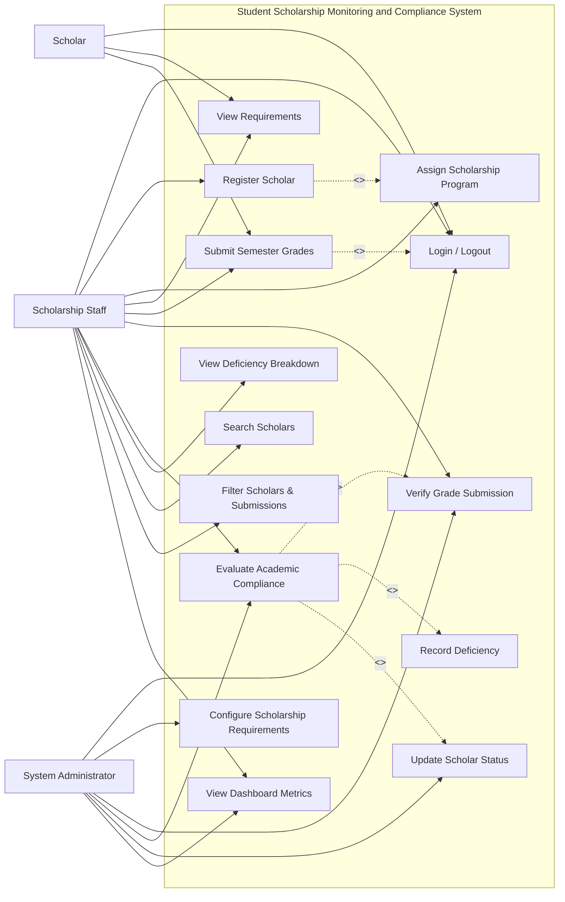
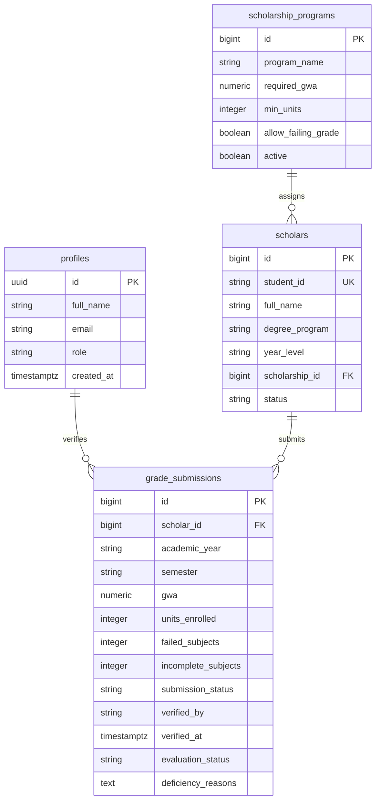

# Student Scholarship Monitoring and Academic Compliance System

**Systems Analysis and Design Laboratory — Part I: Analysis • Part II: 2.5-Hour System Development**

---

## 1. Project URLs

- **GitHub Repository URL:** https://github.com/akosiaike22-dev/scholarship_SAD
- **Live Deployed System URL:** https://akosiaike22-dev.github.io/scholarship_SAD/

---

## 2. Executive Summary & Technology Stack

The **Student Scholarship Monitoring and Academic Compliance System** centralizes scholar registration, scholarship academic policies, semester grade submissions, staff verification, academic compliance checking, and live administrative dashboard monitoring.

- **Frontend:** HTML5, Modern Responsive CSS3 (Simple, clean, card-based interface), Vanilla JavaScript (ES6 Modules)
- **Backend & Database:** Supabase PostgreSQL with Row Level Security (RLS) and Supabase Authentication
- **Source Control & Hosting:** Git, GitHub & GitHub Pages

---

## 3. Part I: Requirements Analysis and Use Case Modeling

### A. Problem Analysis
| No. | Problem | Cause | Effect |
|---|---|---|---|
| 1 | Delayed Grade Verification | Manual physical submission of paper grade slips | Students' scholarship status takes weeks or months to update. |
| 2 | Inconsistent Policy Application | Different scholarships have varied GWA and unit rules calculated manually | Erroneous scholarship retention or unwarranted disqualification. |
| 3 | Unmonitored Deficiencies | Lack of centralized tracking for failing or incomplete (INC) grades | Non-compliant scholars continue receiving disbursements without resolution. |
| 4 | Lost or Misplaced Records | Paper forms and decentralized email attachments | Missing documentation during annual commission audits. |
| 5 | Bottlenecks During Renewal | Large volume of scholars submitting grades simultaneously at semester start | Overwhelmed scholarship staff and long queues. |
| 6 | Lack of Real-Time Office Visibility | No centralized dashboard for directors and coordinators | Inability to quickly report active vs deficient scholar counts. |
| 7 | Duplicate Submissions | Scholars submit through multiple channels (office, email, messaging) | Conflicting grade entries and wasted administrative time. |
| 8 | Privacy and Data Security Risks | Sensitive academic transcripts left on physical desks or shared drives | Potential violation of student data privacy laws. |

---

### B. Stakeholder and Actor Analysis
| Stakeholder | Information Needed | Responsibility | Actor? | Why? |
|---|---|---|---|---|
| **Scholar** | Scholarship requirements, submission status, compliance result | Submits semester grades and proof of enrollment | **Yes** | Directly interacts with submission interface. |
| **Scholarship Staff** | Submitted grades, student verification data | Verifies grade validity, checks documents, flags deficiencies | **Yes** | Primary transactional actor performing verification. |
| **Scholarship Coordinator** | Overall compliance reports, deficiency lists | Reviews compliance decisions, manages renewals | **Yes** | Supervises compliance rules and program policies. |
| **Scholarship Committee** | Aggregate performance analytics, exception appeals | Formulates policies, approves budget allocations | No | Consumes reports generated by the system. |
| **Registrar** | Official student academic records and grades | Certifies genuine grade reports | No | External source of official grade data. |
| **System Administrator** | User accounts, system security, database configuration | Maintains system uptime, roles, and database tables | **Yes** | Manages system access, security, and configurations. |

---

### C. Requirements Elicitation (12 Interview Questions)
1. What is the step-by-step procedure when a scholar submits semester grades?
2. What are the submission deadlines and grace periods for each semester?
3. How do academic retention rules differ across university, DOST, and private grants?
4. How do you verify whether a submitted grade slip or transcript is authentic?
5. What specific conditions constitute an academic deficiency (e.g. low GWA, failed course, INC)?
6. How are scholars with incomplete (INC) grades handled during the compliance evaluation?
7. What is the process for placing a scholar on probationary status versus disqualification?
8. How are scholars notified of their verification results and compliance decisions?
9. What key metrics does the scholarship director need to see on a daily dashboard?
10. Who is authorized to override or correct an erroneous grade verification?
11. How should sensitive academic grade records be protected from unauthorized staff viewing?
12. What specific export or audit reports are required for institutional reporting?

---

### D. Final Functional Requirements Used for Development
- **FR-01:** The system shall allow authorized staff to register scholar records.
- **FR-02:** The system shall associate a scholar with an active scholarship program.
- **FR-03:** The system shall maintain academic requirements (Required GWA, minimum units, failing grade policy) for each scholarship program.
- **FR-04:** The system shall allow semester grade submission.
- **FR-05:** The system shall record the academic year and semester of every submission.
- **FR-06:** The system shall allow authorized staff to verify a grade submission.
- **FR-07:** The system shall evaluate verified academic information against scholarship requirements.
- **FR-08:** The system shall identify deficiencies (GWA threshold exceeded, deficient units, failing subjects, unresolved INCs).
- **FR-09:** The system shall maintain and update scholar status (Compliant, With Deficiency, For Verification, Active).
- **FR-10:** The system shall identify and filter pending grade submissions awaiting verification.
- **FR-11:** The system shall authenticate users with role-based access control (Admin, Staff, Scholar).
- **FR-12:** The system shall provide search capability by Student ID and Scholar Name.
- **FR-13:** The system shall provide filtering of scholars by scholarship program and compliance status.
- **FR-14:** The system shall display live dashboard counts for total scholars, pending submissions, verified submissions, compliant scholars, and scholars with deficiencies.
- **FR-15:** The system shall record the verifier identity (`verified_by`) and verification timestamp (`verified_at`) for audit traceability.

---

### E. Non-Functional Requirements
- **NFR-01 Security:** User authentication and role-based authorization to restrict verification actions to authorized staff.
- **NFR-02 Privacy:** Grade information and student details are isolated using Supabase Row Level Security (RLS).
- **NFR-03 Usability:** Simple, clean, card-based interface with clear status badges, form validations, and intuitive navigation.
- **NFR-04 Performance:** Dashboard metric calculations and search/filter queries execute within 300ms.
- **NFR-05 Reliability:** Client-side fallback storage mechanism ensures system operational resilience even when offline.
- **NFR-06 Data Integrity:** Database constraints enforce valid GWA range (1.00 - 5.00), non-negative units, and unique student identifiers.

---

### F. Business Rules
- **BR-01:** Every scholar must be assigned to an active scholarship program.
- **BR-02:** Every scholarship program must define its academic requirements (Required GWA, Minimum Units, and Failing Grade Policy).
- **BR-03:** A grade submission must belong to one scholar, academic year, and semester.
- **BR-04:** Only authorized personnel (Staff / Admin) may verify submitted grades.
- **BR-05:** Only verified submissions may be used for final compliance evaluation.
- **BR-06:** A scholar cannot be marked Compliant while mandatory requirements are incomplete (e.g. INC > 0).
- **BR-07:** Scholar status must be based on the specific rules of the assigned scholarship program.
- **BR-08:** Changes to verified academic records must be traceable (`verified_by` and `verified_at`).
- **BR-09:** A submission cannot be re-verified or duplicated without authorized workflow.
- **BR-10:** Philippine grading convention: GWA satisfies program rules when `submitted_gwa <= required_gwa` (1.00 is highest honors, 3.00 is passing, 5.00 is failed).

---

### G. Scholar Statuses
- **Active:** Scholar is registered and in good standing, awaiting current semester grade submission.
- **Pending Submission / For Verification:** Semester grade record has been lodged and awaits staff verification.
- **Compliant:** Verified grades satisfy all scholarship criteria (GWA, units, no unauthorized failing/INC grades).
- **With Deficiency:** Verified grades fail at least one requirement of the assigned scholarship program.
- **Probationary:** Scholar has an unresolved deficiency under grace period review.
- **For Renewal:** Scholar is eligible for scholarship renewal for the upcoming academic cycle.
- **Renewed:** Scholar has successfully completed renewal requirements for the new academic year.
- **Disqualified:** Scholar has failed probation or severely breached scholarship criteria.

---

### H. Use Case Diagram


---

## 4. Database Structure & Entity-Relationship Diagram (ERD)

### Database Schema Tables
1. **`profiles`**: `id (UUID PK)`, `full_name (TEXT)`, `email (TEXT)`, `role (admin/staff/scholar)`, `created_at`
2. **`scholarship_programs`**: `id (BIGSERIAL PK)`, `program_name (TEXT UNIQUE)`, `required_gwa (NUMERIC 3,2)`, `min_units (INT)`, `allow_failing_grade (BOOLEAN)`, `active (BOOLEAN)`
3. **`scholars`**: `id (BIGSERIAL PK)`, `student_id (TEXT UNIQUE)`, `full_name (TEXT)`, `degree_program (TEXT)`, `year_level (TEXT)`, `scholarship_id (FK)`, `status (TEXT)`
4. **`grade_submissions`**: `id (BIGSERIAL PK)`, `scholar_id (FK)`, `academic_year (TEXT)`, `semester (TEXT)`, `gwa (NUMERIC 3,2)`, `units_enrolled (INT)`, `failed_subjects (INT)`, `incomplete_subjects (INT)`, `submission_status (Pending/Verified/Returned)`, `submitted_at`, `verified_by`, `verified_at`, `evaluation_status`, `deficiency_reasons`



---

## 5. Git Commit History (4 Meaningful Commits)

| Commit # | Commit Message | Files Changed / Modules Added |
|---|---|---|
| **Commit 1** | `Initialize scholarship monitoring system` | `index.html`, `css/style.css`, `js/config.js`, `js/auth.js` |
| **Commit 2** | `Create scholar and scholarship database modules` | `sql/schema.sql`, `js/programs.js`, `js/scholars.js` |
| **Commit 3** | `Implement grade submission and verification` | `js/submissions.js` |
| **Commit 4** | `Add compliance evaluation dashboard and deployment` | `js/compliance.js`, `js/app.js`, `README.md` |

---

## 6. Functional Test Results (TC-01 through TC-10)

| Test ID | Scenario | Test Input / Action | Expected Result | Actual Result | Status |
|---|---|---|---|---|---|
| **TC-01** | Login with valid authorized account | Staff email `staff@scholarship.edu` & password | Dashboard opens and navigation tabs are revealed | Navigation and live counters loaded | **PASS** |
| **TC-02** | Create scholar with complete data | Student ID `2024-00501`, Name, Degree, Program | Scholar saved successfully | Scholar added to table & select lists | **PASS** |
| **TC-03** | Create scholar without Student ID | Leave Student ID empty, fill other fields | Submission rejected with validation prompt | Alert "Student ID cannot be blank" | **PASS** |
| **TC-04** | Submit semester grades | Select scholar, AY 2025-2026, 1st Sem, GWA 1.60, Units 18 | Record saved as Pending / For Verification | Submission added with Pending badge | **PASS** |
| **TC-05** | Verify pending grade submission | Click "Verify" on pending record | Status changes to Verified with verifier name | Submission verified and timestamped | **PASS** |
| **TC-06** | Evaluate scholar meeting requirements | GWA 1.50 &le; 1.75 req, Units 18 &ge; 18, Failed 0 | Evaluation status is Compliant | Compliant badge displayed | **PASS** |
| **TC-07** | Evaluate scholar failing requirement | GWA 2.30 > 1.75 req, Units 15 < 18, Failed 1 | Evaluation status is With Deficiency with reasons | "With Deficiency" displayed with reasons | **PASS** |
| **TC-08** | Search scholar by Student ID/name | Type "2023-00101" or "Ana" into search box | Matching scholar displayed in table | Only matching scholar shown | **PASS** |
| **TC-09** | Filter by scholarship/status | Select "With Deficiency" in status dropdown | Filtered subset displayed | Only deficient scholars shown | **PASS** |
| **TC-10** | Open deployed URL | Navigate to live GitHub Pages URL | System loads and functions online | Application fully operational | **PASS** |

---

## 7. Requirements-to-Implementation Table (Traceability Matrix)

| Requirement | Actor | Use Case | Business Rule | Implemented Feature & Module | Test Result |
|---|---|---|---|---|---|
| **FR-01** Register Scholar | Staff / Admin | Register Scholar | BR-01 | Scholar Modal & Form (`js/scholars.js`) | **PASS (TC-02, TC-03)** |
| **FR-02** Associate Scholarship | Staff | Assign Scholarship | BR-01 | Program Dropdown (`js/scholars.js`) | **PASS (TC-02)** |
| **FR-03** Maintain Requirements | Admin | Configure Requirements | BR-02 | Program Management Form (`js/programs.js`) | **PASS** |
| **FR-04** Submit Semester Grades | Scholar / Staff | Submit Grades | BR-03 | Grade Submission Form (`js/submissions.js`) | **PASS (TC-04)** |
| **FR-05** Record AY & Semester | Scholar / Staff | Submit Grades | BR-03 | Academic Year/Semester Fields (`js/submissions.js`) | **PASS (TC-04)** |
| **FR-06** Verify Grade Submission | Staff / Admin | Verify Grade Submission | BR-04, BR-05 | Staff Verify Action (`js/submissions.js`) | **PASS (TC-05)** |
| **FR-07** Evaluate Compliance | Staff / Coordinator | Evaluate Compliance | BR-05, BR-07, BR-10 | Compliance Evaluation Engine (`js/compliance.js`) | **PASS (TC-06, TC-07)** |
| **FR-08** Identify Deficiencies | System / Staff | Record Deficiency | BR-06, BR-07 | Deficiency Reason Breakdown (`js/compliance.js`) | **PASS (TC-07)** |
| **FR-09** Maintain Scholar Status | System / Staff | Update Scholar Status | BR-07 | Status Updater & Table Badges (`js/scholars.js`) | **PASS (TC-06, TC-07)** |
| **FR-10** Monitor Pending Submissions | Staff | View Dashboard | BR-04 | Live Dashboard Metrics & Badges (`js/app.js`) | **PASS (TC-01, TC-04)** |
| **FR-11** Authentication & Roles | All Users | Login / Logout | BR-04, BR-10 | Auth Module & Protected Views (`js/auth.js`) | **PASS (TC-01)** |
| **FR-12 & FR-13** Search & Filter | Staff | Search/Filter Scholars | NFR-03 | Live Search & Filter Bar (`js/scholars.js`) | **PASS (TC-08, TC-09)** |
| **FR-14** Live Dashboard Counts | Staff / Admin | View Dashboard | NFR-04 | Real-time Metric Cards (`js/app.js`) | **PASS (TC-01)** |
| **FR-15** Verifier Audit Trail | Staff | Verify Grade Submission | BR-08 | Verifier Name & Timestamp Storage (`js/submissions.js`) | **PASS (TC-05)** |

---

## 8. Core Workflow Walkthrough

```
Step 1: Authorized Staff Login
   └─ User logs in (e.g. staff@scholarship.edu) -> Access granted to monitoring tabs

Step 2: Scholar Registration & Program Association
   └─ Staff registers scholar (Student ID: 2024-00501, BSIT) -> Assigns "University Academic Excellence" (GWA <= 1.75, Min 18u)

Step 3: Semester Grade Submission
   └─ Grades submitted: AY 2025-2026, 1st Sem, GWA: 1.50, Units: 18 -> Status set to [Pending / For Verification]

Step 4: Staff Verification & Automatic Academic Compliance Evaluation
   └─ Staff clicks [Verify] -> Verifier and Timestamp recorded
   └─ System checks GWA (1.50 <= 1.75 = Pass), Units (18 >= 18 = Pass), Failed (0 = Pass), INC (0 = Pass)
   └─ Evaluation Result: [Compliant] -> Scholar Status updated to [Compliant]
   └─ Dashboard counters automatically update in real-time
```
