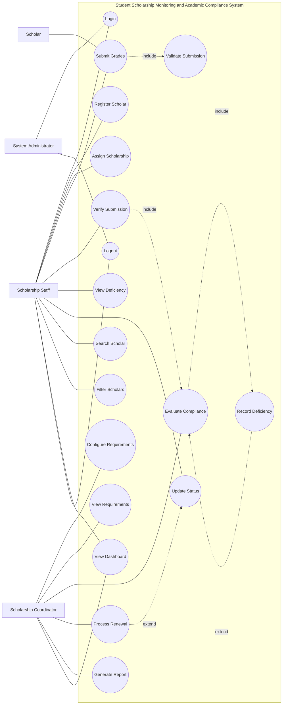
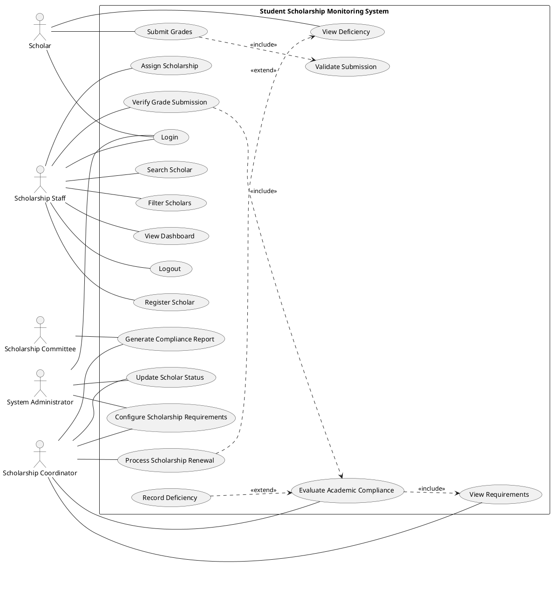

# Requirements Analysis and Use Case Notes

## A. Problem Analysis

| No. | Problem | Cause | Effect |
|---|---|---|---|
| 1 | Scholar records are duplicated | Separate spreadsheets and paper forms | Conflicting identities and counts |
| 2 | Scholarship conditions are applied inconsistently | Requirements are scattered or remembered | Incorrect renewal/compliance decisions |
| 3 | Grade submissions are difficult to track | No shared submission register | Missed or late submissions |
| 4 | Verification ownership is unclear | No verifier/timestamp log | Decisions are hard to audit |
| 5 | Academic periods are mislabeled | Manual entry without consistent fields | Results may be compared to the wrong term |
| 6 | Deficiencies are found late | No per-program evaluation | Scholars have less time to resolve problems |
| 7 | Status reports require manual counting | Data is split across files | Slow, error-prone reporting |
| 8 | Sensitive grade records are broadly shared | Weak file permissions | Privacy risk |

## B. Stakeholder and Actor Analysis

| Stakeholder | Information needed | Responsibility | Actor? | Why |
|---|---|---|---|---|
| Scholar | Submission deadlines, recorded grades, status, deficiencies | Provide accurate semester information and respond to deficiencies | Yes, future/self-service scope | Would submit and view own records |
| Scholarship Staff | Scholar/program records, pending submissions, results | Maintain records and verify submissions | Yes | Primary operational user |
| Scholarship Coordinator | Counts, compliance results, program rules | Oversee policy and monitoring | Yes | Reviews outcomes and requirements |
| Scholarship Committee | Exceptions and renewal recommendations | Decide exceptional awards/renewals | No in this prototype | Decision body; not a core transaction user |
| Registrar | Official grades and enrollment | Provide authoritative academic records | No in this prototype | Source system, not integrated in this scope |
| System Administrator | Accounts, roles, configuration | Maintain Supabase and grant roles | Yes | Manages authorized system access |

## C. Requirements Elicitation Questions

1. How are scholars registered and how is duplicate identity checked?
2. Which scholarship programs are currently active?
3. What GWA scale is used, and does a lower or higher value represent better performance?
4. What minimum units apply to each program and term?
5. Are failing grades allowed for any programs, and under what conditions?
6. What academic year and semester labels should the office use?
7. Who may submit grades, and may staff submit on a scholar's behalf?
8. What is the submission deadline and how are late submissions handled?
9. Which documents, if any, must accompany grades?
10. Who verifies grades and what checks are performed?
11. Can a submission be returned for correction, and who may resubmit it?
12. How should incomplete subjects affect eligibility and when are they considered resolved?
13. What deficiency statuses and remediation steps are recognized?
14. How are probation, renewal, and disqualification decided?
15. Which reports and dashboard counts are needed by staff and coordinators?
16. Which users may view identifiable grade records or change roles?
17. How long must verified records and audit details be retained?

## D. Functional Requirements

| ID | Requirement |
|---|---|
| FR-01 | The system shall allow authorized staff to create and update scholar records. |
| FR-02 | The system shall associate each scholar with one scholarship program. |
| FR-03 | The system shall maintain per-program GWA, minimum units, failing-grade policy, and active state. |
| FR-04 | The system shall allow authorized staff to submit semester grades for a scholar. |
| FR-05 | The system shall record academic year and semester for every grade submission. |
| FR-06 | The system shall allow staff/admin users to verify pending grade submissions. |
| FR-07 | The system shall evaluate verified submissions using the scholar's assigned program requirements. |
| FR-08 | The system shall store and display reasons for a deficiency. |
| FR-09 | The system shall maintain the scholar's current status. |
| FR-10 | The system shall identify pending grade submissions. |
| FR-11 | The system shall authenticate users and restrict protected pages to staff/admin roles. |
| FR-12 | The system shall search scholars by student ID or scholar name. |
| FR-13 | The system shall filter scholars by program and status. |
| FR-14 | The system shall display live dashboard counts from database records. |
| FR-15 | The system shall prevent duplicate student IDs and duplicate scholar/period submissions. |
| FR-16 | The system shall record who verified a submission and when. |
| FR-17 | The system shall display verified compliance results and deficiency reasons. |

## E. Non-Functional Requirements

| ID | Category | Requirement |
|---|---|---|
| NFR-01 | Security | All application tables shall use row-level security; verification shall be role-checked in PostgreSQL. |
| NFR-02 | Privacy | Only authenticated authorized staff/admin may read identifiable scholar and grade records. |
| NFR-03 | Usability | Forms shall use labels, browser validation, and clear error messages. |
| NFR-04 | Performance | Typical lists and dashboard totals shall load through indexed Supabase queries without a build server. |
| NFR-05 | Reliability | Verification and compliance updates shall execute atomically in one database function. |
| NFR-06 | Data Integrity | Foreign keys, unique constraints, and range/check constraints shall enforce valid records. |

## F. Business Rules

| ID | Business rule |
|---|---|
| BR-01 | Every scholar must be assigned to a scholarship program. Staff select an active program for new assignments. |
| BR-02 | Each scholarship program defines its own GWA, minimum-unit, and failing-grade requirements. |
| BR-03 | A grade submission belongs to exactly one scholar and academic year/semester; the period is unique per scholar. |
| BR-04 | Only authenticated staff/admin may verify a submission. |
| BR-05 | Only verified submissions may have a final compliance result. |
| BR-06 | A scholar is not Compliant if a required condition fails or an incomplete subject remains. |
| BR-07 | Compliance uses the rules of the scholarship assigned to that scholar at verification time. |
| BR-08 | Verification records the verifier identity and verification timestamp. |
| BR-09 | A non-pending submission cannot be verified again; no correction workflow is included in this prototype. |
| BR-10 | Grade records are unavailable to anonymous users; only staff/admin can read them. |
| BR-11 | GWA follows the 1.00-best to 5.00-worst convention; required_gwa is the maximum permitted value, so submitted GWA must be <= required_gwa. |
| BR-12 | A passing result requires enrolled units >= minimum units and, when failing grades are disallowed, failed_subjects = 0. |

## G. Scholar Statuses

| Status | Condition / use |
|---|---|
| Active | Current scholar record with no newer workflow state set |
| Pending Submission | Office expects a grade report and no submission is currently awaiting verification |
| For Verification | A grade submission is awaiting staff review |
| Compliant | Most recently verified submission meets all program conditions |
| With Deficiency | Most recently verified submission fails at least one condition |
| Probationary | Manually selected status for an approved probation period |
| For Renewal | Manually selected status when a renewal decision is due |
| Renewed | Manually selected status after renewal approval |
| Disqualified | Manually selected status after authorized disqualification decision |

## H. Use Case Analysis

Actors: Scholarship Staff, Scholarship Coordinator, System Administrator, Scholar (future/self-service actor).
System boundary: Student Scholarship Monitoring and Academic Compliance System.

| ID | Use case | Primary actor |
|---|---|---|
| UC-01 | Login | Staff/Admin |
| UC-02 | Register Scholar | Scholarship Staff |
| UC-03 | Assign Scholarship | Scholarship Staff |
| UC-04 | Configure Scholarship Requirements | Coordinator |
| UC-05 | View Requirements | Staff/Coordinator |
| UC-06 | Submit Grades | Scholarship Staff (scholar self-service is future scope) |
| UC-07 | Verify Grade Submission | Scholarship Staff |
| UC-08 | Evaluate Academic Compliance | System, initiated by Staff |
| UC-09 | Record Deficiency | System |
| UC-10 | View Deficiency | Staff/Coordinator |
| UC-11 | Update Scholar Status | Scholarship Staff/Coordinator |
| UC-12 | Process Scholarship Renewal | Coordinator |
| UC-13 | Search Scholar | Scholarship Staff |
| UC-14 | Filter Scholars | Scholarship Staff |
| UC-15 | Generate Compliance Report | Coordinator |
| UC-16 | View Dashboard | Staff/Coordinator |
| UC-17 | Logout | Staff/Admin |

## I. Detailed Use Cases

### UC-06 Submit Grades

| Element | Description |
|---|---|
| Primary actor | Scholarship Staff (scholar self-service is future scope) |
| Goal | Save a semester grade record for authorized review |
| Preconditions | User is signed in as staff/admin; scholar exists and has a program |
| Trigger | User opens Grade Submissions and submits the form |
| Main flow | Select scholar; enter academic year, semester, GWA, units, failures and incompletes; validate; save as Pending |
| Alternative flow | Invalid ranges or duplicate term cause a clear error and no record is saved |
| Exception flow | Supabase/network error is shown; record is not reported as saved |
| Postconditions | A Pending submission exists; scholar status becomes For Verification |
| Related requirements | FR-04, FR-05, FR-10, FR-15 |
| Business rules | BR-03, BR-11, BR-12 |

### UC-07 Verify Grade Submission

| Element | Description |
|---|---|
| Primary actor | Scholarship Staff |
| Goal | Record a trusted verification and obtain compliance outcome |
| Preconditions | User is staff/admin; submission is Pending |
| Trigger | User selects Verify & evaluate |
| Main flow | Database checks role and status; loads assigned program; evaluates criteria; stores Verified, verifier, time, outcome, and reasons atomically |
| Alternative flow | Requirement failure results in With Deficiency and specific reasons |
| Exception flow | Non-staff role or non-pending record is rejected by PostgreSQL |
| Postconditions | Submission cannot be verified again; scholar status reflects result |
| Related requirements | FR-06, FR-07, FR-08, FR-09, FR-16 |
| Business rules | BR-04 through BR-12 |

### UC-08 Evaluate Academic Compliance

| Element | Description |
|---|---|
| Primary actor | System, initiated by staff verification |
| Goal | Compare verified grades against the assigned scholarship rules |
| Preconditions | Submission is Pending and its scholar/program relations exist |
| Trigger | Successful verification request |
| Main flow | Compare GWA <= program maximum; units >= minimum; enforce failing-grade policy; check unresolved incompletes; store Compliant only if all pass |
| Alternative flow | Store With Deficiency and each failed criterion |
| Exception flow | Missing program or unauthorized caller aborts transaction |
| Postconditions | Final result, reasons, verifier and time persist; scholar status updates |
| Related requirements | FR-07, FR-08, FR-09 |
| Business rules | BR-02, BR-05 through BR-08, BR-11, BR-12 |

### UC-12 Process Scholarship Renewal

| Element | Description |
|---|---|
| Primary actor | Scholarship Coordinator |
| Goal | Record a renewal decision using verified monitoring results |
| Preconditions | Scholar and verified academic record exist; coordinator has reviewed requirements |
| Trigger | Coordinator reviews the scholar for the next award period |
| Main flow | Review latest compliance result and status; decide renewal; authorized staff updates status to For Renewal, Renewed, Probationary, or Disqualified as appropriate |
| Alternative flow | Deficiency is referred for remediation or committee review rather than renewed |
| Exception flow | Missing/unverified grades are not treated as compliant evidence |
| Postconditions | Scholar status reflects the separately authorized renewal decision |
| Related requirements | FR-09 and monitoring requirements |
| Business rules | BR-05 through BR-07 |

## XVII. Requirements-to-Implementation Traceability

| Requirement | Use case | Implemented feature | Test/check |
|---|---|---|---|
| FR-01 Register Scholar | UC-02 | Add/edit scholar form | TC-02, TC-03 |
| FR-02 Associate Scholar | UC-03 | Required program selector and FK | TC-02 |
| FR-03 Maintain Requirements | UC-04 | Program create/edit page | Configure and reload |
| FR-04 Submit Grades | UC-06 | Grade form inserts Pending record | TC-04 |
| FR-05 Record Period | UC-06 | Academic year and semester fields | TC-04 |
| FR-06 Verify Grades | UC-07 | Role-checked database RPC | TC-05 |
| FR-07 Evaluate Compliance | UC-08 | Program-specific atomic SQL evaluation | TC-06, TC-07 |
| FR-08 Identify Deficiencies | UC-09/10 | Stored/displayed reasons | TC-07 |
| FR-09 Maintain Status | UC-11 | Scholar status update on verification; editable status | TC-06, TC-07 |
| FR-10 Monitor Pending | UC-16 | Live dashboard count and pending list | TC-04 |
| FR-11 Authentication | UC-01/17 | Supabase Auth page guard and role check | TC-01 |
| FR-12 Search | UC-13 | Student ID/name search | TC-08 |
| FR-13 Filter | UC-14 | Program/status selectors | TC-09 |
| FR-14 Dashboard | UC-16 | Exact counts queried from Supabase | Refresh/count validation |
| FR-15 Data uniqueness | UC-02/06 | SQL unique constraints | Duplicate ID/term check |
| FR-16 Audit verification | UC-07 | `verified_by`, `verified_at` set by SQL | Inspect verified record |
| FR-17 View outcomes | UC-10/15 | Compliance table and latest results | TC-06, TC-07 |

## Functional Test Checklist

Run with a configured Supabase project and staff account. These are manual integration checks; this source workspace has no supplied Supabase credentials and cannot run them against a real backend yet.

| Test | Scenario | Expected result |
|---|---|---|
| TC-01 | Sign in with authorized staff account | Dashboard opens; unauthenticated pages redirect |
| TC-02 | Create complete scholar | Database row appears with assigned program |
| TC-03 | Submit scholar with blank student ID | Browser/database rejects it |
| TC-04 | Submit grades | Row is saved Pending; dashboard updates |
| TC-05 | Verify pending row as staff | Row is Verified and verifier/time are recorded |
| TC-06 | Verify grades meeting configured rules | Compliant result and scholar status |
| TC-07 | Verify grades failing one configured rule | With Deficiency and reason shown |
| TC-08 | Search by ID/name | Matching scholar rows remain |
| TC-09 | Filter by program/status | Only matching rows remain |
| TC-10 | Open GitHub Pages URL | Static app loads and connects to Supabase |
# Systems Analysis and Design: Scholarship Monitoring

## A. Problem Analysis

| No. | Problem | Cause | Effect |
|---|---|---|---|
| 1 | Scholar data is duplicated | Separate spreadsheets and forms | Conflicting records and repeated work |
| 2 | Scholarship policies are applied inconsistently | Requirements are stored in separate documents | Incorrect continuation decisions |
| 3 | Missing grade submissions are hard to identify | No centralized semester tracker | Delayed follow-up and renewal decisions |
| 4 | Verification status is unclear | Handoffs are handled by email or paper | Staff cannot see what needs action |
| 5 | Calculations are manual | Staff compare grades with policy documents | Slow evaluation and arithmetic errors |
| 6 | Deficiencies are not consistently recorded | Results are communicated informally | Scholars may not know what to correct |
| 7 | Reports require manual consolidation | Data is split across files | Management receives stale counts |
| 8 | Access to grades is not controlled consistently | Shared files or broad email distribution | Privacy and confidentiality risk |

## B. Stakeholders and Actors

| Stakeholder | Information needed | Responsibility | Actor? | Reason |
|---|---|---|---|---|
| Scholar | Assigned program, submission requirements, own status/deficiencies | Submit semester information and respond to office | Yes (future/self-service actor) | Interacts with submission and status services |
| Scholarship Staff | Scholar/program data, pending grades, verification queue | Register records, verify submissions, maintain statuses | Yes | Direct user of staff workflows |
| Scholarship Coordinator | Program rules, compliance summaries, renewal candidates | Set policy and oversee monitoring | Yes | Uses configuration and compliance/reporting functions |
| Scholarship Committee | Verified compliance and deficiency summaries | Decide exceptions/renewals | Yes (report consumer) | Consumes system outputs for decisions |
| Registrar | Academic record accuracy | Provide/confirm official academic information | External supporting stakeholder | Not an app actor in this prototype; no registrar integration |
| System Administrator | Accounts, roles, deployment and security configuration | Manage Supabase and authorized users | Yes | Controls users and system configuration |

## C. Requirements Elicitation Interview Questions

1. How are scholarship applications and scholar records registered today?
2. Which student identifiers and academic details are required?
3. Who is allowed to assign or change a scholarship program?
4. When are semester grades due, and how are deadlines communicated?
5. What grade scale does the institution use, and does a lower or higher GWA represent better performance?
6. Do GWA limits, unit minimums, and failing-grade rules differ by scholarship?
7. What documents or academic evidence are required with a submission?
8. Who checks a submission and what evidence makes it verified?
9. What should happen when a submission is incomplete or incorrect?
10. Which academic failures or incompletes count as a deficiency?
11. How are probation, renewal, and disqualification decisions made?
12. Who may view identifiable grades, change requirements, or verify records?
13. Which pending, compliant, deficiency, and renewal reports are needed and how often?
14. Should scholars receive status notifications, and through what channel?
15. How long must submissions and verification history be retained?

## D. Functional Requirements

| ID | Requirement |
|---|---|
| FR-01 | The system shall allow authorized staff to register scholar records. |
| FR-02 | The system shall associate each scholar with a scholarship program. |
| FR-03 | The system shall maintain academic requirements for each scholarship program. |
| FR-04 | The system shall allow authorized staff to submit semester grades for a scholar. |
| FR-05 | The system shall record the academic year and semester of every submission. |
| FR-06 | The system shall allow authorized staff to verify a pending grade submission. |
| FR-07 | The system shall evaluate verified academic information against the assigned program requirements. |
| FR-08 | The system shall identify and store reasons for academic deficiencies. |
| FR-09 | The system shall maintain each scholar's current status. |
| FR-10 | The system shall identify pending grade submissions. |
| FR-11 | The system shall authenticate users and restrict staff pages to staff/admin roles. |
| FR-12 | The system shall allow authorized staff to update scholar records. |
| FR-13 | The system shall search scholars by student ID or name. |
| FR-14 | The system shall filter scholars by assigned program and status. |
| FR-15 | The system shall display live database counts and recent submissions on the dashboard. |
| FR-16 | The system shall retain the verifying user's ID and verification timestamp. |
| FR-17 | The system shall prevent duplicate student IDs and duplicate scholar-period submissions. |

## E. Non-Functional Requirements

| ID | Category | Requirement |
|---|---|---|
| NFR-01 | Security | Protected data shall use Supabase Auth and PostgreSQL row-level security; only public client keys may be shipped to browsers. |
| NFR-02 | Privacy | Grade records shall be available only to authenticated, authorized scholarship staff in this prototype. |
| NFR-03 | Usability | Forms shall label required values and show understandable validation/error messages. |
| NFR-04 | Performance | Dashboard and list views shall query current records directly and return only required columns where practical. |
| NFR-05 | Reliability | Verification, evaluation, verifier attribution, and status update shall execute as one database transaction. |
| NFR-06 | Data Integrity | Foreign keys, unique constraints, range checks, and role checks shall protect persisted records. |

## F. Business Rules

| ID | Business rule |
|---|---|
| BR-01 | Every scholar must be assigned to an active scholarship program. |
| BR-02 | Every scholarship program must define its academic requirements. |
| BR-03 | A grade submission must belong to one scholar, academic year, and semester; that period is unique per scholar. |
| BR-04 | Only authorized personnel (staff/admin profiles) may verify submitted grades. |
| BR-05 | Only verified submissions may have a final compliance evaluation. |
| BR-06 | A scholar cannot be marked Compliant while any mandatory requirement is incomplete. |
| BR-07 | Scholar status must be based on the rules of the assigned scholarship program. |
| BR-08 | Changes to verification outcomes are traceable to a verifier and timestamp; verified submissions cannot be verified again. |
| BR-09 | A submission cannot be verified twice without an authorized correction process; correction workflow is outside this prototype. |
| BR-10 | Sensitive grade information must only be visible to authorized users. |
| BR-11 | GWA uses a 1.00 (best) to 5.00 (worst) scale; `required_gwa` is the maximum acceptable value, so `submitted_gwa <= required_gwa` passes. |
| BR-12 | A passing evaluation also requires enrolled units at least `min_units`, no failing subjects when failing grades are disallowed, and zero unresolved incomplete subjects. |

## G. Scholar Status Definitions

| Status | Condition |
|---|---|
| Active | Registered and assigned, with no newer submission workflow/status overriding it. |
| Pending Submission | Office expects grades, but no submission has been received; this prototype does not automatically set deadlines. |
| For Verification | A new pending grade submission exists. |
| Compliant | Latest verified evaluation meets every assigned program condition. |
| With Deficiency | Latest verified evaluation fails one or more conditions. |
| Probationary | Authorized office decision for a scholar under probation; maintained manually. |
| For Renewal | Scholar is approaching a renewal review; maintained manually. |
| Renewed | Renewal has been approved; maintained manually. |
| Disqualified | Authorized office decision; maintained manually. |

## H. Use Cases

Actors: Scholar, Scholarship Staff, Scholarship Coordinator, Scholarship Committee, System Administrator. The current staff interface implements staff/admin transactions. Scholar self-service, committee reports, and renewal processing are future-scope use cases.

### Detailed use cases

**UC-07 Submit Grades**

| Element | Description |
|---|---|
| Primary actor / goal | Authorized staff submits one scholar's semester results for verification. |
| Preconditions | User is authenticated as staff/admin; scholar and active program exist. |
| Trigger | Staff selects Grade Submissions and completes the form. |
| Main flow | Select scholar; enter year, semester, GWA, units, failures, incompletes; validate; save with Pending status and timestamp. |
| Alternative flow | Staff corrects invalid values and resubmits; an existing scholar-period record is reported as duplicate. |
| Exception flow | Network/database error is shown; no success is reported. |
| Postconditions | One Pending grade record exists and scholar status is For Verification. |
| Related requirements / rules | FR-04, FR-05, FR-10; BR-03, BR-05. |

**UC-08 Verify Grade Submission**

| Element | Description |
|---|---|
| Primary actor / goal | Scholarship Staff verifies one pending submission. |
| Preconditions | Authenticated staff/admin; submission exists and is Pending. |
| Trigger | Staff chooses Verify & evaluate for a pending row. |
| Main flow | Database checks staff role and pending state; records verifier/time; loads scholar's assigned program; evaluates all rules; stores Verified/result/reasons and scholar status atomically. |
| Alternative flow | Staff reviews another pending item; user may cancel before verification. |
| Exception flow | Unauthorized role, missing record, or non-pending record is rejected by the database. |
| Postconditions | Submission becomes Verified exactly once; final result and reasons are stored. |
| Related requirements / rules | FR-06 to FR-09, FR-16; BR-04 to BR-08. |

**UC-09 Evaluate Academic Compliance**

| Element | Description |
|---|---|
| Primary actor / goal | Staff obtains a final result for verified grades. |
| Preconditions | Submission is Pending and staff invokes verification; program has current requirements. |
| Trigger | Verification function evaluates the record. |
| Main flow | Compare GWA to the assigned program maximum, units to program minimum, failure count to policy, and incomplete count to zero; save Compliant if all pass, otherwise With Deficiency and reasons. |
| Alternative flow | Any failed condition contributes a stored reason; all conditions are still checked. |
| Exception flow | Database rejects evaluation if record is already verified or user lacks role. |
| Postconditions | Verified result is persisted and scholar status reflects result. |
| Related requirements / rules | FR-07 to FR-09; BR-02, BR-05 to BR-07, BR-11, BR-12. |

**UC-14 Process Scholarship Renewal**

| Element | Description |
|---|---|
| Primary actor / goal | Coordinator records the outcome of a renewal review. |
| Preconditions | Scholar has verified academic history and is eligible for office review. |
| Trigger | Coordinator opens a scholar record for a renewal decision. |
| Main flow | Review verified results; record decision as Renewed, For Renewal, Probationary, or Disqualified according to office policy; communicate decision. |
| Alternative flow | Committee requests clarification and defers decision. |
| Exception flow | Missing verified academic history prevents a decision until resolved. |
| Postconditions | Scholar status reflects the authorized renewal decision. |
| Related requirements / rules | FR-09; BR-07. This workflow is documented but is not implemented in the timed prototype. |

## I. Requirements Traceability and Test Plan

| Requirement | Use case | Business rule | Implemented feature / test |
|---|---|---|---|
| FR-01 Register Scholar | Register Scholar | BR-01 | Scholar form; TC-02, TC-03 |
| FR-02 Associate Scholar | Assign Scholarship | BR-01, BR-07 | Required program selection; TC-02 |
| FR-03 Maintain Requirements | Configure Requirements | BR-02, BR-11, BR-12 | Program editor; TC-06, TC-07 |
| FR-04 Submit Grades | Submit Grades | BR-03 | Grade form; TC-04 |
| FR-05 Record Period | Submit Grades | BR-03 | Academic year/semester fields; TC-04 |
| FR-06 Verify Submission | Verify Grade Submission | BR-04, BR-08, BR-09 | Protected RPC; TC-05 |
| FR-07 Evaluate Compliance | Evaluate Compliance | BR-02, BR-05, BR-07 | Database evaluation function; TC-06, TC-07 |
| FR-08 Identify Deficiencies | Record/View Deficiency | BR-06, BR-12 | Stored reason array and Compliance page; TC-07 |
| FR-09 Maintain Status | Update Scholar Status | BR-07 | Database updates status on submit/verification; manual statuses editable; TC-06, TC-07 |
| FR-10 Identify Pending | View Dashboard / Verify | BR-05 | Live pending count and queue; TC-04, TC-05 |
| FR-11 Authentication | Login/Logout | BR-04, BR-10 | Supabase Auth, protected staff pages; TC-01 |
| FR-12 Update Scholar | Register Scholar | BR-01 | Scholar edit action; TC-02 |
| FR-13 Search | Search Scholar | BR-10 | Student ID/name live filtering; TC-08 |
| FR-14 Filter | Filter Scholars | BR-10 | Program/status filters; TC-09 |
| FR-15 Dashboard | View Dashboard | BR-05 | Exact counts from Supabase; TC-01 |
| FR-16 Verification audit | Verify Grade Submission | BR-08 | `verified_by` and `verified_at`; TC-05 |

Functional test results must be recorded after configuring a real Supabase project and deploying. TC-10 requires a GitHub Pages deployment URL; it cannot be truthfully marked passed before deployment.
